# Release Management and Deployment

This page explains how a new backend Docker image is created, where it is published, and how it is deployed to the university course server.

## Overview

```mermaid
flowchart LR
  A["Backend change"] --> B["Feature or fix branch"]
  B --> C["Pull Request to development"]
  C --> D["Reviewed and merged into development"]
  D --> E["Milestone PR from development to main"]
  E --> F["Merge into main"]
  F --> G["GitHub Actions builds Docker image"]
  G --> H["Push to GHCR"]
  H --> I["Course server redeploys automatically"]
  I --> J["Health check is verified"]
```



## Repositories and Artifacts


| Purpose                      | Location                                           |
| ---------------------------- | -------------------------------------------------- |
| Backend code                 | `https://github.com/SS26-SE2-Codenames/Backend`    |
| Dockerfile                   | `Backend/Dockerfile`                               |
| Local Compose setup          | `Backend/docker-compose.yml`                       |
| Docker build workflow        | `Backend/.github/workflows/docker.yml`             |
| Container registry           | `ghcr.io/ss26-se2-codenames/backend`               |
| University config repository | `https://github.com/AAU-SE2/SE2-26S-server-config` |
| Course server                | `se2-demo.aau.at`                                  |
| Health endpoint              | `GET /health`                                      |

## When Is a Docker Image Built?

A new Docker image is built automatically whenever a commit is pushed to the `main` branch of the backend repository.

The workflow is located in:

```text
Backend/.github/workflows/docker.yml
```

It is triggered by:

```yaml
on:
  push:
    branches: [ "main" ]
```

The workflow builds and pushes two image tags:

```text
ghcr.io/ss26-se2-codenames/backend:latest
ghcr.io/ss26-se2-codenames/backend:<commit-sha>
```

Tag meaning:

- `latest`: always points to the most recent image built from `main`.
- `<commit-sha>`: points to the exact commit from which the image was built.

For the course server deployment, `latest` is useful because the server automatically redeploys after pushes to `main`. A SHA tag is more explicit and reproducible, but using it would require updating the Compose file whenever a new version should be deployed.

## What Needs to Happen for Updates to Reach main?

The detailed contribution workflow is documented in `CONTRIBUTING.md`.

For deployment, the important part is:

- regular feature and fix work is merged into `development` first
- finished, reviewed milestones are merged from `development` into `main`
- only pushes or merges to `main` trigger the Docker image build and deployment chain

After a milestone is merged into `main`, check the backend repository under `Actions` and verify that `Build and Push Docker Image` succeeded.

## How Does the Image Get to GHCR?

The GitHub Actions workflow does the following:

1. Checks out the repository.
2. Logs in to GitHub Container Registry (`ghcr.io`) using `GITHUB_TOKEN`.
3. Builds the Docker image.
4. Pushes both tags to GHCR.

The image paths are:

```text
ghcr.io/ss26-se2-codenames/backend:latest
ghcr.io/ss26-se2-codenames/backend:<commit-sha>
```

To manually check whether an image is available:

```bash
docker pull ghcr.io/ss26-se2-codenames/backend:latest
```

If this fails, check:

- Did the GitHub Actions workflow complete successfully?
- Is the package visible in GHCR?
- Is the package public, or is authentication required?

## How to Run the Backend Locally with Docker

For local testing with PostgreSQL:

```bash
cd Backend
docker compose up --build
```

The Compose setup starts:

- `postgres` with the database `codenames`
- `backend` on host port `53213`, internally using port `8080`

The local health check is:

```bash
curl http://localhost:53213/health
```

Expected response:

```json
{"status":"UP"}
```

## How Does the Image Get Deployed to the University Server?

The university course server is:

```text
se2-demo.aau.at
```

Deployment is handled automatically through the config repository:

```text
https://github.com/AAU-SE2/SE2-26S-server-config
```

The setup requires two steps.

### Step 1: Docker Compose File in the Backend Repository

The backend repository must contain a Docker Compose file in its root directory. The filename can be chosen freely, but it must be referenced in the config repository.

Important: The university server should use a prebuilt Docker image. It should not build the image directly on the server, so the Compose file must use `image:` instead of `build: .`.

Minimal example:

```yaml
services:
  server:
    image: ghcr.io/ss26-se2-codenames/backend:latest
    restart: unless-stopped
    ports:
      - "53213:8080"
```

The left side of the port mapping is the assigned university server port. The right side is the internal port used by the backend container.

### Step 2: One-Time Pull Request in the Config Repository

In the config repository, create one file under `groups/grp-N.yml`, for example:

```yaml
name: grp-x-codenames
repository_url: https://github.com/SS26-SE2-Codenames/Backend.git
reference: main
compose_files:
  - docker-compose.yml
```

Then open a Pull Request against `main` in the config repository.

After this PR is merged, deployment runs automatically:

- The server is deployed within approximately three minutes.
- Every push to `main` in the backend repository automatically triggers a redeployment.
- It is not necessary to open a new config PR for every backend update.

A new config PR is only required if the deployment configuration changes, for example:

- the Compose filename changes
- the deployed branch changes
- the port changes
- the repository URL changes
- the group config file changes

## Where Is the Server Running?

In the local Compose setup, the backend runs at:

```text
http://localhost:53213
```

The production course server runs at:

```text
se2-demo.aau.at
```

The concrete external port is the assigned group port. This repository currently uses port `53213` locally:

```text
http://se2-demo.aau.at:53213
```

If the assigned port is different, replace `53213` with the correct group port.

## Health Points

### Backend

Endpoint:

```text
GET /health
```

Expected response:

```json
{"status":"UP"}
```

Local example:

```bash
curl http://localhost:53213/health
```

Course server example:

```bash
curl http://se2-demo.aau.at:53213/health
```

### PostgreSQL in the Compose Setup

The PostgreSQL container has a Docker health check:

```text
pg_isready -U codenames_user -d codenames
```

In the Compose setup, the backend only starts after PostgreSQL is marked as healthy.

## Rollback

If a new deployment fails:

1. Check which commit worked previously.
2. Fix the backend on `main` or revert to a working commit.
3. Push or merge the fix into `main`.
4. Wait until GitHub Actions has pushed the new image to GHCR.
5. Wait until the course server redeploys automatically.
6. Run the health check again.

If the Compose file uses a fixed SHA tag instead of `latest`, the image reference must be changed back to a working SHA tag. In that case, a new config PR is required because the deployment configuration changes.

## Troubleshooting


| Problem                            | What to Check                                                                                       |
| ---------------------------------- | --------------------------------------------------------------------------------------------------- |
| No new image in GHCR               | Was the change really merged into`main`? Did the GitHub Actions workflow succeed?                   |
| `docker pull` fails                | Is the GHCR package public, or is login required?                                                   |
| Course server does not redeploy    | Is the one-time config PR merged? Does`reference` point to `main`? Is the Compose filename correct? |
| Backend does not start             | Check backend container logs; verify database URL and credentials.                                  |
| Backend cannot connect to database | Is PostgreSQL running? Is`SPRING_DATASOURCE_URL` correct in the deployment?                         |
| `/health` does not respond         | Is the container running? Are port mapping, reverse proxy, and firewall correct?                    |
| WebSocket issues                   | Check the configured allowed origins in`app.allowed-origins`.                                       |

## Handover Checklist

- [ ]  Backend changes are merged into `development` first.
- [ ]  Finished, reviewed milestones are merged from `development` into `main`.
- [ ]  GitHub Action `Build and Push Docker Image` is green after the merge into `main`.
- [ ]  GHCR contains `backend:latest` and `backend:<commit-sha>`.
- [ ]  Docker Compose file in the backend repository uses a prebuilt image, not `build: .`.
- [ ]  One-time config PR in `AAU-SE2/SE2-26S-server-config` is merged.
- [ ]  Course server automatically redeploys after pushes to `main`.
- [ ]  `GET /health` returns `{"status":"UP"}`.
- [ ]  Frontend points to the correct backend URL.
- [ ]  Correct assigned group port is documented.
